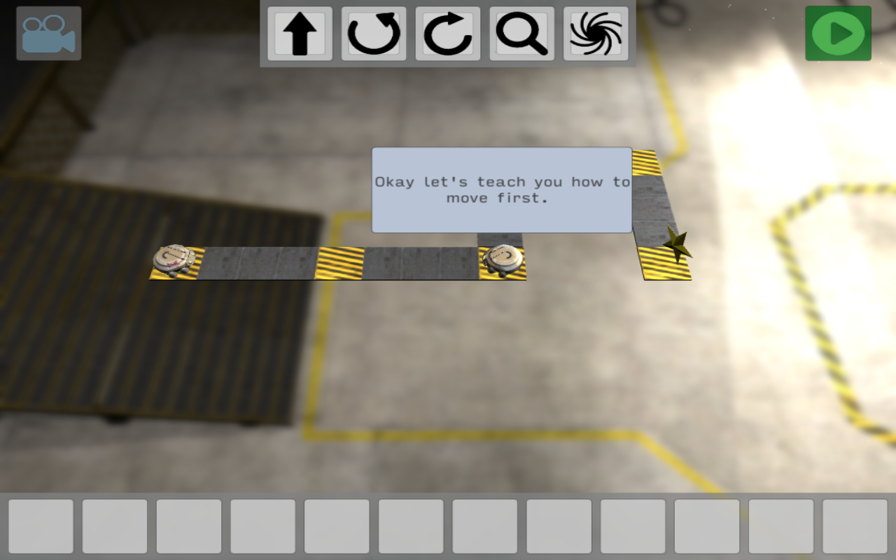
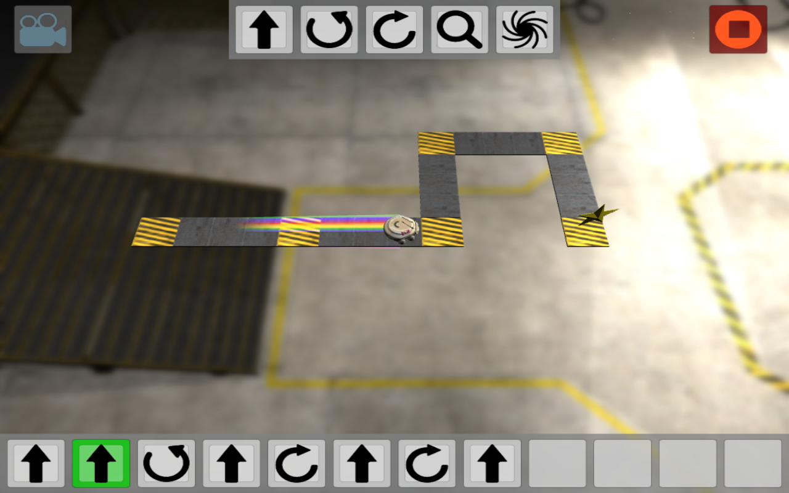
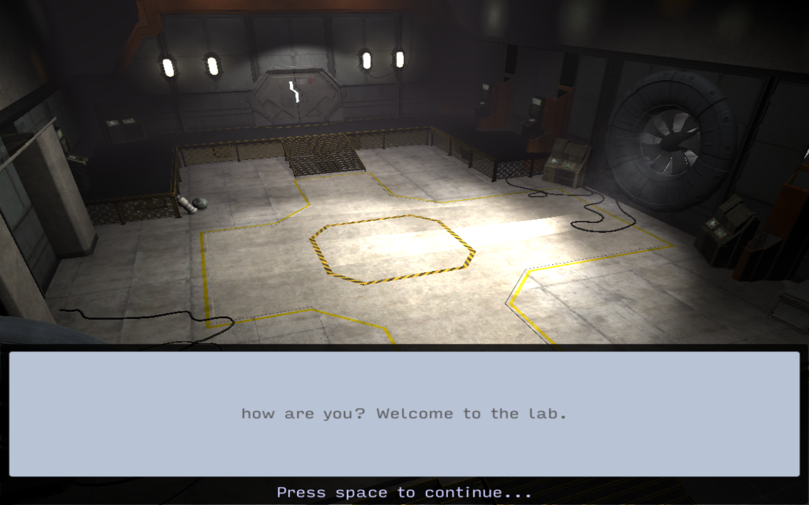

# Graphflow

Graphflow is a lightbot-esque game that teaches concepts of program execution
and linked lists through the use of apt metaphors and cute roombas.

[Download the game](https://www.dropbox.com/sh/i3t0fcerokqcztn/AAAOPGI5CFTVvaTa0gd_lJ7oa?dl=0)

Made with Unity 5
